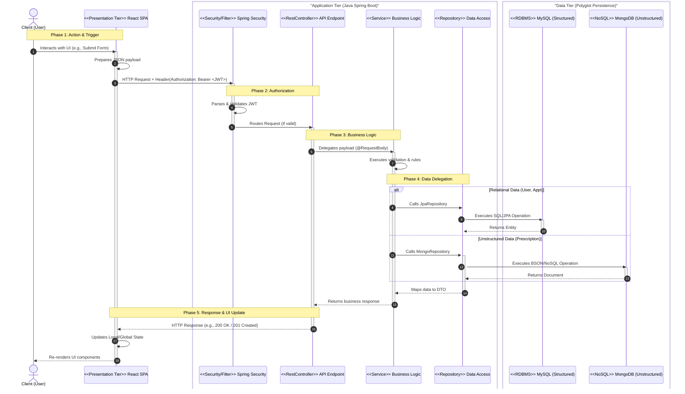
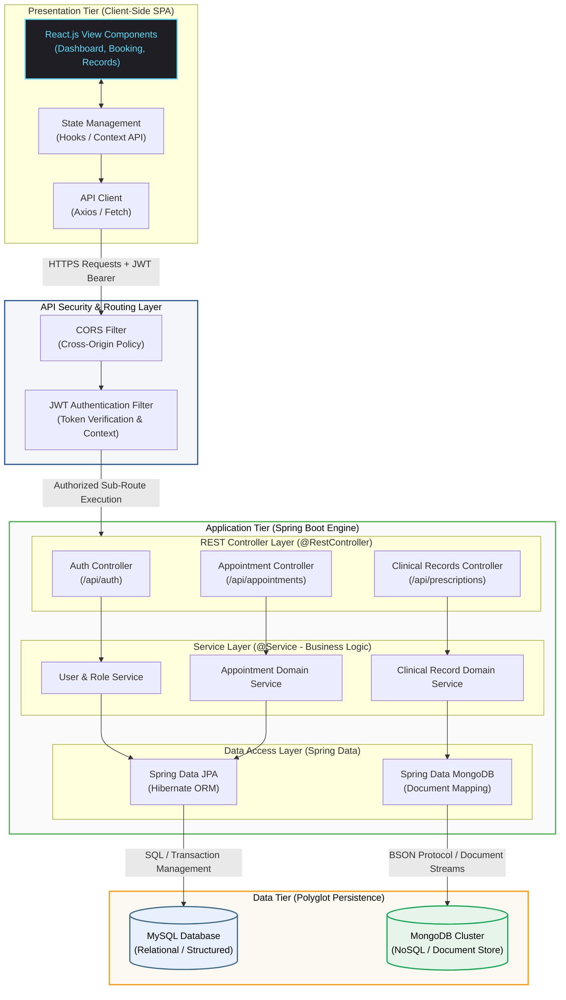

# Smart Clinic Management System: Architecture Design

## Section 1: Architecture Summary
The Smart Clinic Management System leverages a decoupled, three-tier architecture designed for high scalability, separation of concerns, and optimized data storage. The presentation tier is built as a responsive Single Page Application (SPA) using React, which interacts asynchronously with the application tier via RESTful APIs. The backend application tier is powered by Java Spring Boot, acting as a stateless service layer secured by JSON Web Tokens (JWT). To support the diverse data needs of a clinical environment, the data tier utilizes a polyglot persistence strategy: structured, highly transactional data (users, roles, and schedules) is stored in a relational MySQL database managed via Spring Data JPA, while flexible, unstructured clinical data (prescriptions and medical records) is managed within a NoSQL MongoDB document store via Spring Data MongoDB.

## Section 2: Numbered Flow (Request/Response Cycle)

The following sequence details how an asynchronous client request flows through the decoupled architecture to the dual-database tier and returns an updated state to the user interface:

1. **Client Action & Trigger:** A user interacts with the React frontend (e.g., submitting an appointment booking form or creating a prescription) which dispatches an HTTP request (via `fetch` or `axios`) containing a JSON payload and an `Authorization: Bearer <JWT>` header.
2. **Security & Routing Layer:** The request arrives at the Spring Boot application, where it is intercepted by the Spring Security filter chain. The system parses and validates the JWT signature and extracts user roles/permissions.
3. **Controller Interception (REST Endpoint):** Once authorized, the request is mapped to a specific `@RestController` endpoint (e.g., `@PostMapping("/api/appointments")`), which acts as the entry point for the Application layer.
4. **Business Logic Execution (Service Layer):** The controller delegates the request payload to the corresponding Service component (annotated with `@Service`), where transactional logic, domain rules, and data validations are enforced.
5. **Data Layer Delegation (Repository):** The service layer invokes the appropriate repository interface:
   - For relational/transactional data, it calls a `JpaRepository` to interface with MySQL.
   - For unstructured or document-heavy data, it calls a `MongoRepository` to interface with MongoDB.
6. **Database Persistence:** The selected database executes the operation:
   - MySQL performs ACID-compliant transactions or updates using organized tables.
   - MongoDB inserts or updates flexible JSON-like BSON documents.
7. **Response Assembly:** The database acknowledges the operation, and the repository maps the data back into a Java entity or Data Transfer Object (DTO). The service layer wraps this into the final business response state.
8. **HTTP Serialization:** The `@RestController` receives the DTO and transmits an HTTP status code (e.g., `201 Created`) along with the serialized JSON response body back across the network.
9. **UI State Update:** The React frontend receives the asynchronous JSON response, updates its local state hook or global state manager, and automatically re-renders the minimalist UI components to reflect the current data to the user.

# Architecture Diagram

